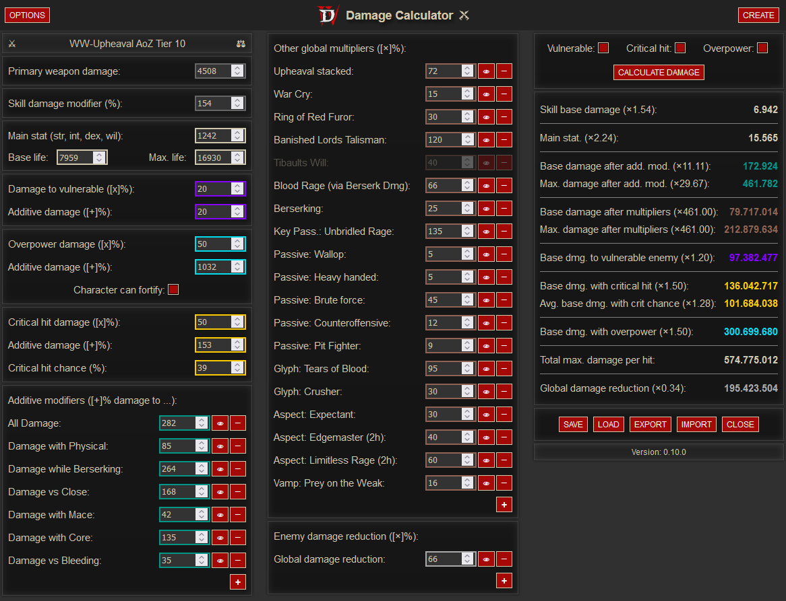
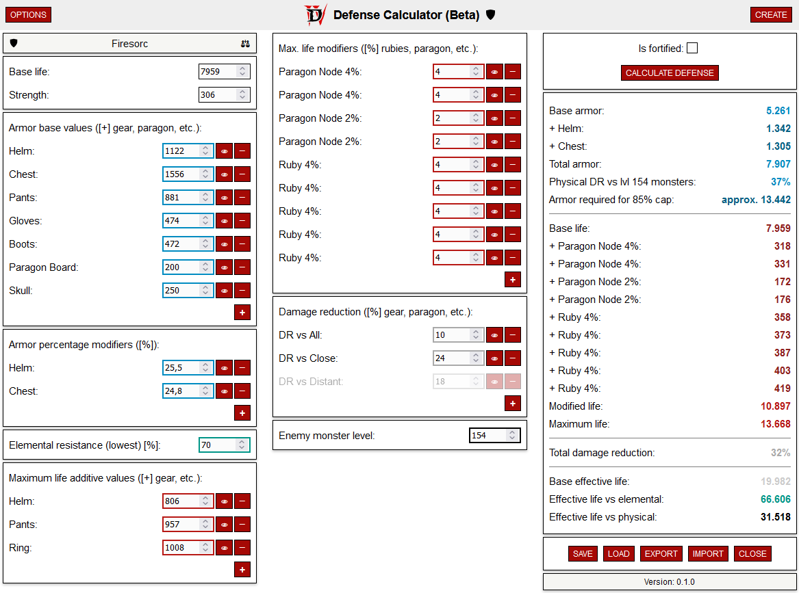

# D4 Tools

Lightweight, clutter-free, web-based, open-source tools for Diablo 4 to calculate stats like damage or defense.

### Common features

- Super lightweight design with no external dependencies (<100kb total size)
- Store calculators in your browser cache (localStorage) and export as JSON files
- Open multiple calculators side by side
- Disable properties temporarily (to quickly see changes)
- Drag & drop sorting
- Responsive design for large (desktop) and small (mobile) screens
- Light/dark mode

## Damage Calculator

The D4 Damage Calculator is a useful tool to assess your build, evaluate your damage and find ways to optimize it.  
It **combines all D4 damage buckets** like weapon damage, main stat (str, dex, int, wil), additive damage ([+]%), multiplicative damage ([x]%) and more to **calculate your total damage** per hit.
In addition it supports **critical hit**, **vulnerable** effect and **overpower** damage (including HP and fortify).
To compare different variants of your build and test changes you can **open multiple calculators** next to each other and easily **store, load and export the data** (as JSON files).  
  
URL: https://bytemind-de.github.io/apps/d4/damage.html  

### Ideas to improve it

- Implement weapon speed and DPS
- Add predefined properties (skills, passives, glyphs, paragon nodes etc.) for the user to select
- Read the data from your actual account via some Blizzard API (d4armory seems to be able to do it, but how???)

### Known bugs / quirks

- To get correct values we need to apply an approx. 66% global damage reduction for monsters. This value seems to be independent of world tier, but I haven't really tested it with low-level characters.

### Screenshots

    

## Defense Calculator

The D4 Defense Calculator is a tool to evaluate your defense and determine your **"effective" life against certain attacks**.
It will also **calculate your armor required to reach the 85% DR cap** against a specific monster level.  
  
URL: https://bytemind-de.github.io/apps/d4/defense.html  

### Ideas to improve it

- Add damage groups to be able to calculate defense for multiple attack types at the same time (close, distant, fire, poison, etc.)
- Simplify handling of rubies and paragon nodes (% life), so you don't have to enter every single one

### Known bugs / quirks

- There might be slight rounding errors in the result, because the game often doesn't give you the full values (e.g. Doombringer is actually 41.44% life not 41.4% etc.)

### Screenshots

    

